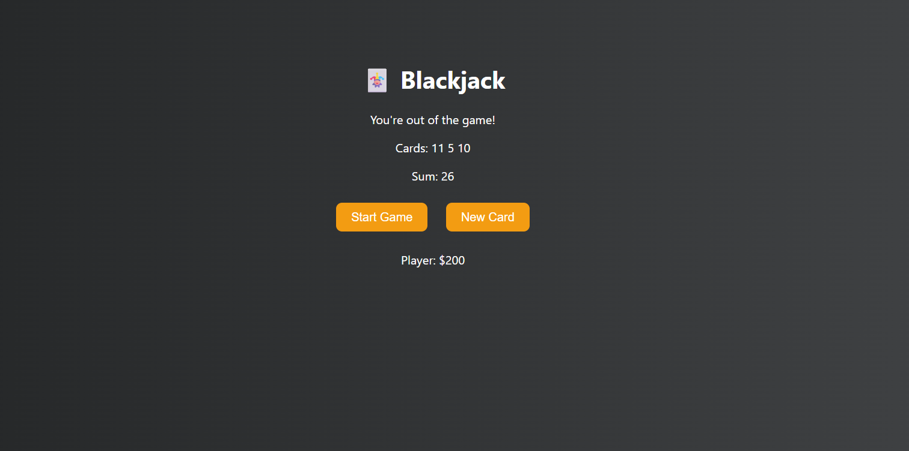

# 🃏 Blackjack Game

This is a simple JavaScript project built as part of the **Scrimba Learn JavaScript** course.

The game simulates a basic version of Blackjack:
- Draw two random cards at the start.
- Draw additional cards if you want to get closer to 21.
- Try to get exactly 21 to win.
- If your total exceeds 21, you lose.

## 📸 Preview



## 🛠 Technologies Used
- HTML
- CSS
- JavaScript

## ▶️ How to Use
1. Clone the repository:
   ```
   git clone https://github.com/jaber2003/blackjack-game.git
   ```
2. Open the folder.
3. Open `index.html` in your browser.

## 📁 Project Structure
```
blackjack-game/
├── index.html
├── style.css
├── script.js
└── README.md
```

---

✅ Built by [Jaber Abu Zarqa](https://github.com/jaber2003)
